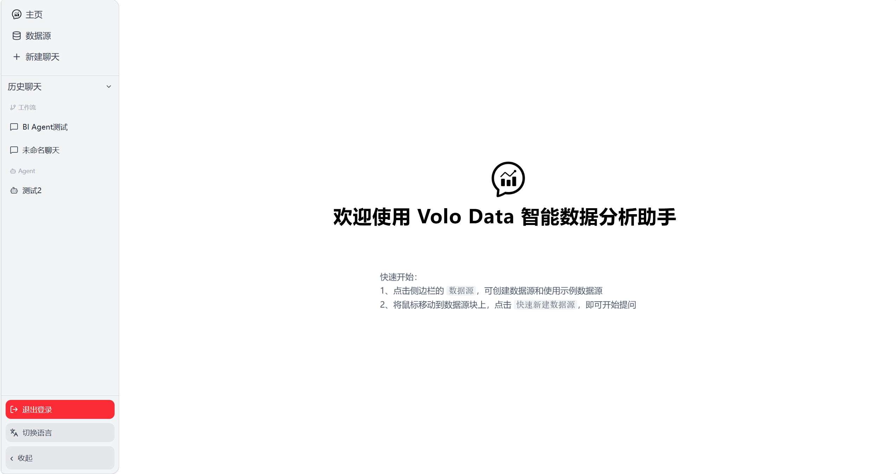
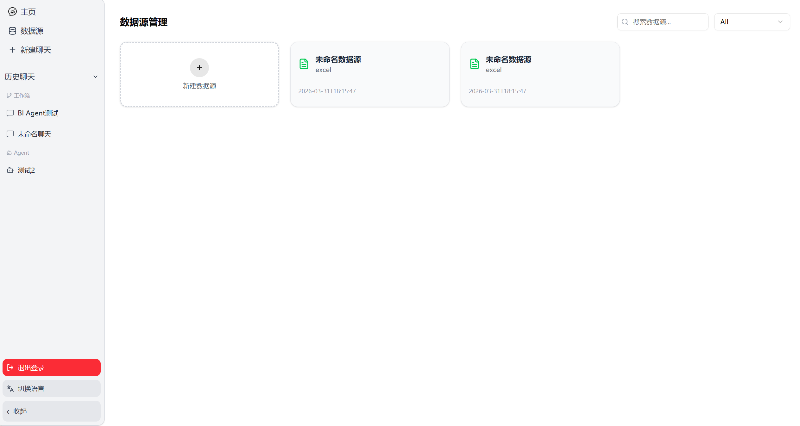
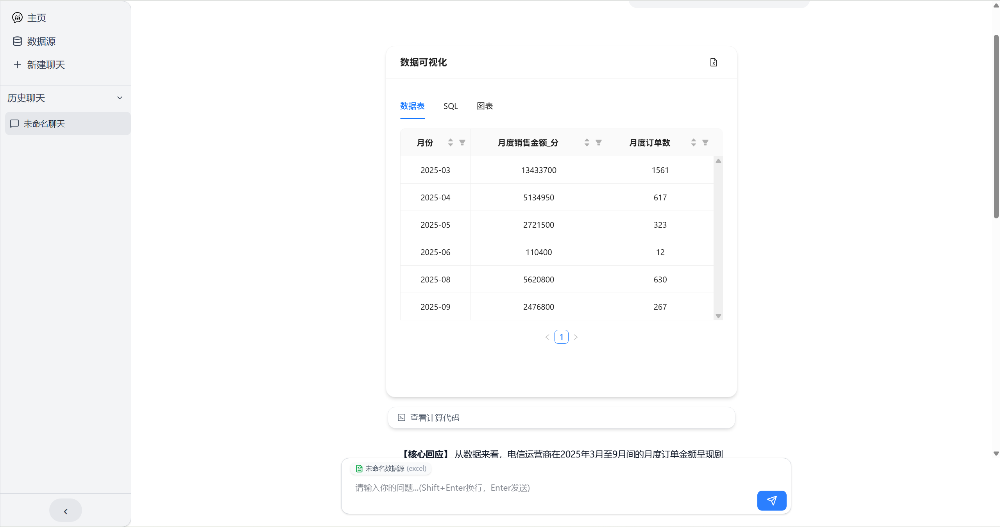
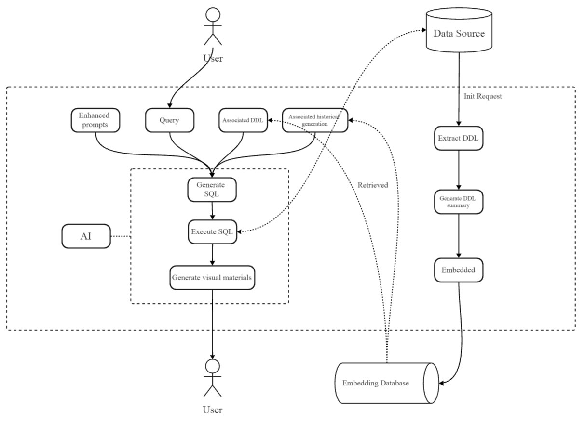

# 🚀 VoloData

[English](./README_EN.md) | [中文](./README.md)

<p align="center">
  
</p>

<p align="center">
  
  
  
  
  
  
  
  
</p>

> 🤖 一个基于 AI 的数据库交互平台，支持多数据源连接、自然语言查询和智能对话。我开源的目的是，想让全球的开发者推动此项目更加安全、更加专业、更加智能。

## ❓ 为什么要使用 Volo Data

### 现有的 NL2SQL 工具通常存在以下问题：

- 难以接入多数据源
- 缺少可扩展 AI 工作流
- 不支持实时流式响应

### VoloData 提供：

- 针对开源项目 [Vanna](https://github.com/vanna-ai/vanna) 中 SQL 生成阶段的 LLM 提示词进行深度优化
- LangGraph AI workflow
- 多数据库统一接口
- SSE 实时响应
- 安全代码沙箱

## ✨ 主要特性

| 特性 | 描述 |
|:---:|:---|
| 🔗 **多数据源支持** | MySQL、PostgreSQL、SQLite、Excel、CSV |
| 💬 **自然语言查询** | AI 模型将自然语言转换为 SQL |
| 🧠 **智能对话系统** | 向量数据库 + 对话历史管理 |
| ⚡ **实时流式响应** | Server-Sent Events (SSE) 即时推送 |
| 🔒 **API Key 认证** | 内置安全认证机制 |
| 📦 **Docker 容器化** | 开箱即用的 Docker Compose |
| 🛡️ **代码沙箱** | 安全运行 LLM 生成的指标计算代码 |

## 🖼️ 项目预览
### 主页
<p align="center">
  
</p>

### 数据源
<p align="center">
  
</p>

### 聊天界面
<p align="center">
  
</p>

更多项目预览信息，请查看产品使用手册（正在完善中）

## 🏗️ 核心业务流程

<p align="center">
  
</p>

## 🛠️ 技术栈

### Backend

| 框架 | 用途 |
|:---|:---|
| **FastAPI** | 现代 Web 框架 |
| **SQLAlchemy** | ORM 框架 |
| **Alembic** | 数据库迁移 |
| **ChromaDB** | 向量数据库 |
| **Redis** | 缓存 & 队列 |
| **Pydantic** | 数据验证 |
| **Langgraph** | AI 工作流 |

### Frontend

| 框架 | 用途 |
|:---|:---|
| **Next.js** | React 框架 |
| **TypeScript** | 类型安全 |
| **TailwindCSS** | 样式框架 |

### DevOps

| 工具 | 用途 |
|:---|:---|
| **Docker** | 容器化部署 |
| **Docker Compose** | 多容器编排 |
| **GitHub Actions** | CI/CD |

## 🚀 快速部署

### Docker 一键部署

```bash
# 克隆项目
git clone https://github.com/keminze/volo-data.git
cd volo-data

# 启动所有服务
docker-compose up -d
```

### 开发环境中的 Docker 一键部署

运行以下命令前，可修改 `.env.langsmith` 文件（非必须），随后在 LangSmith 中可查看工作流运行日志，具体配置请查阅 [LangSmith Docs](https://docs.langchain.com/langsmith/home)

```bash
docker-compose -f docker-compose.dev.yml up -d
```

> ✅ 启动完成后访问: http://localhost:3000

## 📁 项目结构

```
volo-data/
├── main.py                    # 🏁 应用入口
├── requirements.txt           # 📦 Python 依赖
├── Dockerfile                 # 🐳 Docker 配置
├── docker-compose.yml         # 🧩 完整环境配置
├── docker-compose.dev.yml     # 💻 开发环境配置
├── alembic.ini               # 🔄 数据库迁移配置
├── redis_client.py           # 📡 Redis 客户端
│
├── config/                   # ⚙️ 配置模块
│   ├── database.py          # 数据库配置
│   ├── logging_config.py    # 日志配置
│   ├── models.py            # SQLAlchemy 模型
│   └── parameter.py         # 参数配置
│
├── routers/                 # 🛤️ API 路由
│   ├── connection.py        # 数据源连接
│   ├── conversation.py      # 对话管理
│   ├── database.py          # 数据库操作
│   ├── generate.py          # 任务生成
│   └── log.py               # 日志查询
│
├── services/                # 🧩 业务逻辑
│   ├── db.py                # 数据库业务
│   ├── graph.py             # 图相关操作
│   ├── graph_sse.py         # SSE 流式响应
│   ├── tools.py             # 工具函数
│   ├── prompt.py            # 提示词管理
│   ├── vanna.py             # SQL 生成
│   └── log.py               # 日志业务
│
├── middlewares/             # 🔧 中间件
│   ├── api_key_middleware.py # API Key 认证
│   └── logging.py            # 日志中间件
│
├── vanna/                   # 🤖 Vanna SQL 生成
├── frontend/                # 🎨 Next.js 前端
└── alembic/                 # 🔁 数据库迁移
```

### 本地开发

#### 前置要求
- Python 3.12+
- Node.js 20+

#### 步骤

```bash
# 1. 克隆项目
git clone https://github.com/keminze/volo-data.git
cd volo-data

# 2. 创建虚拟环境
python -m venv env
# Windows
env\Scripts\activate
# Linux/macOS
source env/bin/activate

# 3. 安装依赖
pip install -r requirements.txt

# 4. 环境配置
# 复制 .env.example 为 .env 并修改配置

# 5. 初始化数据库
alembic upgrade head

# 6. 启动后端 (端口 9000)
python main.py --port 9000

# 7. 启动前端 (新终端)
cd frontend
npm install
npm run dev
```

## 📚 API 文档

启动服务后访问:

| 文档 | 地址 |
|:---|:---|
| **Swagger UI** | http://localhost:9000/docs |
| **ReDoc** | http://localhost:9000/redoc |

## 🔐 安全配置

### API 认证

所有请求需携带 API Key:

```bash
curl -H "X-API-Key: your-api-key" http://localhost:9000/connections
```

### 环境变量

> ⚠️ 敏感信息通过环境变量配置，**不要**提交到代码库

```bash
# 添加到 .gitignore
echo ".env" >> .gitignore
```

## 🗃️ 数据库迁移

```bash
# 创建新迁移
alembic revision --autogenerate -m "描述迁移内容"

# 应用迁移
alembic upgrade head

# 回滚迁移
alembic downgrade -1
```

## 🤝 贡献

欢迎贡献！请阅读 [CONTRIBUTING.md](./CONTRIBUTING.md) 了解详情。

```bash
1. Fork 项目
2. 创建功能分支: git checkout -b feature/AmazingFeature
3. 提交更改: git commit -m 'Add AmazingFeature'
4. 推送到分支: git push origin feature/AmazingFeature
5. 开启 Pull Request
```

## ✍️ 未来计划

### 即将发布的功能特性

- 更多数据源支持
- SQL 安全审计（自愈/纠错）
- 更优秀的 Agent 记忆管理
- 前端接入 i18n，面向国际化

### 正在规划的功能特性

- 可视化仪表盘
- 数据权限与行级过滤
- 企业级文档 RAG，增强数据分析准确性

## 📄 许可证

本项目采用 [Apache 2.0 License](./LICENSE) 许可证。

## 📬 联系方式

| 渠道 | 链接 |
|:---|:---|
| 🐛 问题反馈 | [Issues](https://github.com/keminze/volo-data/issues) |
| 💬 讨论 | [Discussions](https://github.com/keminze/volo-data/discussions) |
| 📧 邮箱 | kmz3225147671@gmail.com |

## 💖 致谢

感谢以下开源项目:

| 项目 | 用途 |
|:---|:---|
| [Vanna](https://github.com/vanna-ai/vanna) | SQL 生成 |
| [ChromaDB](https://github.com/chroma-core/chroma) | 向量数据库 |
| [FastAPI](https://github.com/tiangolo/fastapi) | Web 框架 |
| [langchain-sandbox](https://github.com/langchain-ai/langchain-sandbox.git) | 代码沙箱 |
| [LangGraph](https://github.com/langchain-ai/langgraph.git) | AI 工作流 |

## 📊 项目统计

<div align="center">


</div>

<p align="center">
  如果这个项目对你有帮助，请点个 ⭐ Star 吧！
</p>